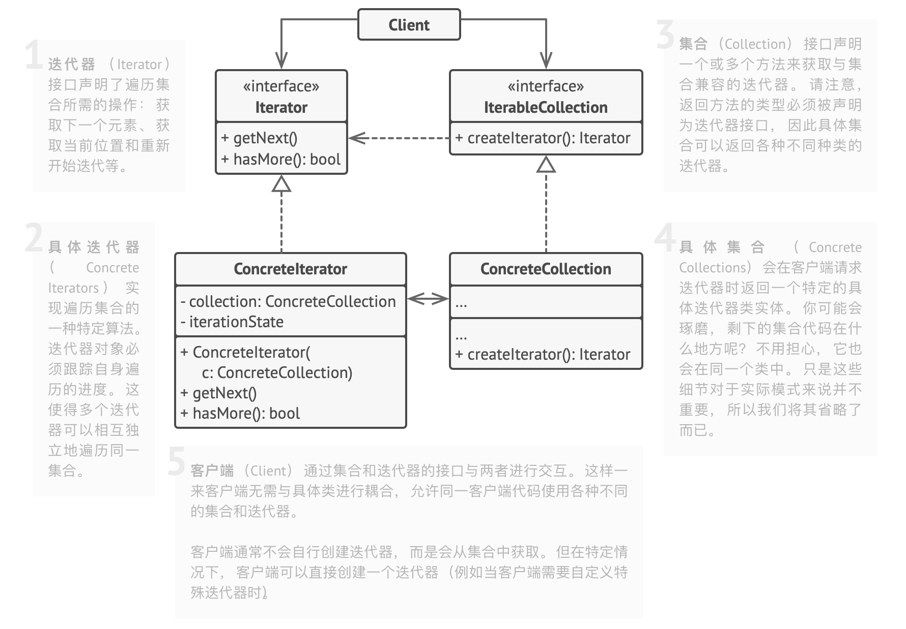
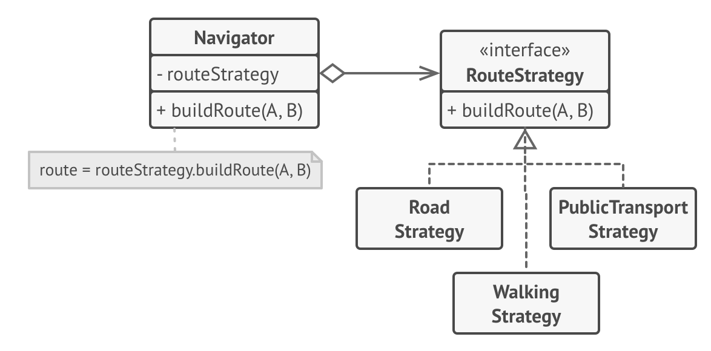

# Funny JSON Explorer 进阶


## 前置学习

### 迭代器模式

- 场景
  - 不暴露集合底层表现形式 （列表、 栈和树等） 的情况下遍历集合中所有的元素。
  - 统一的迭代器接口
    - 具体的迭代算法实现



### 访问者模式

- 将算法与其所作用的对象隔离开来

  - 用另一个类处理原始对象

- 双分派

  - 如何在另一个模块 Visitor 实现对多态对象 A 的对应函数分派？在 A 里加入一个简单的 accept 函数进行分派

    ```cpp
    class NodeA {
      void accept(Visitor v) {
      	v.visitNodeA(this);
      }
    };
    
    class Visitor {
     	void visitNodeA(NodeA *);
      void visitNodeB(NodeB *); 
      // 甚至可以重载
    }
    ```

    

### 策略模式

- 找出负责用许多不同方式完成特定任务的类， 然后将其中的算法抽取到一组被称为*策略*的独立类中
  - 很简单的思想，就是一层通用抽象整合不同的具体方法



## 开发过程

### 架构设计 v0

FJE 初版

- JsonNode 组合模式表示 json 树
- JsonLeaf : JsonNode
- JsonContainer : JsonNode
- JsonTree 读取并存储 json
- Drawer 基类
- TreeDrawer : Drawer 实现自己的绘制 build 方法
- RectDrawer : Drawer 实现自己的绘制 build 方法
- DrawerFactory 抽象工厂基类
  - createTreeDrawer() 默认工厂方法 无图标
  - createRectDrawer() 默认工厂方法 无图标
- PokerIconDrawerFactory : DrawerFactory 方片、黑桃图标簇
- ConfigIconDrawerFactory : DrawerFactory 配置文件图标簇
- OutputBuffer, OutputLine

### 架构设计 v1

1. 增加 JsonNode 的迭代器
2. 将 Drawer 视为 Visitor
3. 其他小问题
   - Drawer::draw() 直接传入 jsonTree 而不是 root

---

- JsonNode 组合模式表示 json 树

  - JsonLeaf : JsonNode
  - JsonContainer : JsonNode

- JsonCollection

  - JsonTree: JsonCollection 读取并存储 json

  > 假设还有 JsonMap: JsonCollection

- JsonIterator

  - JsonTreeIterator: JsonIterator

- Visitor

  - visit( JsonLeaf ) 抽象

  - visit( JsonContainer ) 抽象

  - Drawer: Visitor

    实现 visit，就是在画

    - TreeDrawer : Drawer 实现自己的绘制 build 方法
    - RectDrawer : Drawer 实现自己的绘制 build 方法

- DrawerFactory 抽象工厂基类

  - createTreeDrawer() 工厂方法
  - createRectDrawer() 工厂方法
  - PokerIconDrawerFactory : DrawerFactory 方片黑桃图标簇
  - ConfigIconDrawerFactory : DrawerFactory 配置文件图标簇

- OutputBuffer, OutputLine


### 模块设计

- JsonCollection

  - readJson(file)
  - clearJson()

- JsonTree: JsonCollection

  - readJson(file)
  - 私有 parseJsonTree(file)
  - clearJson() 

- JsonIterator

  - getNext(): JsonIterator

  - hasNext(): bool

  - 数据访问

    - getLevel
    - getContent
    - isLastChild

    利用这些来判断当前用什么样子的 indent

- JsonTreeIterator

  - 实现 getNext()
  - 实现数据访问：& JsonNode

- Visitor

  - visit( JsonLeaf )
  - visit( JsonContainer )

- Drawer: Visitor

  - 不同的 visit 调用不同的 draw 方法


## 问题

### open

- 

### closed

- 双分派是个好东西，解决了我上次想不到的问题

  > 关于架构设计v3中的问题，我选择第二种方法
  >
  > 1. 使用 jsonNode 的多态虚函数来调用对应的 drawer 函数，避免 draw 的 if 判断
  >    - 但这样子 draw 会引用 node，node 也需要传入 drawer，相互引用
  >
  > 2. 或者为 Node 添加一个通用的类型判断 isLeaf；或者添加通用的 getChildren，只是 leaf 返回空
  >    - 但是这样就相当于在 draw 里面判断当前 Node 是什么动态类型的，似乎不符合开闭原则？

  这个问题就可以利用双分派的访问者来解决：

  - 让 node 传入 visitor，这样 visitor 的逻辑代码仍然维持在 visitor 自己内部，不会与 node 强耦合
  - draw 使用 visitor / 让 drawer 本身就是一个具体 visitor

- 不会有 node 和 drawer 相互依赖的问题：

  - node 和 Visitor 基类构成相互引用
  - 但 node 不会引用 Visitor 的子类，所以新的 Drawer 不会影响到 JsonNode

- C++ 目录一般怎么布置基类子类？

  ```cpp
  1. 
  Visitor.h
  Visitor/
      VisitorA.h
      VisitorA/ ...
  
  2.
  Visitor/
      Visitor.h
      VisitorA/
           VisitorA.h
           ...
  ```

  还是 2 更清楚一点
