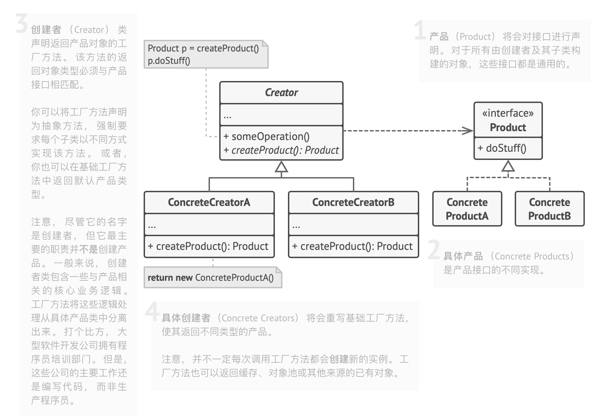
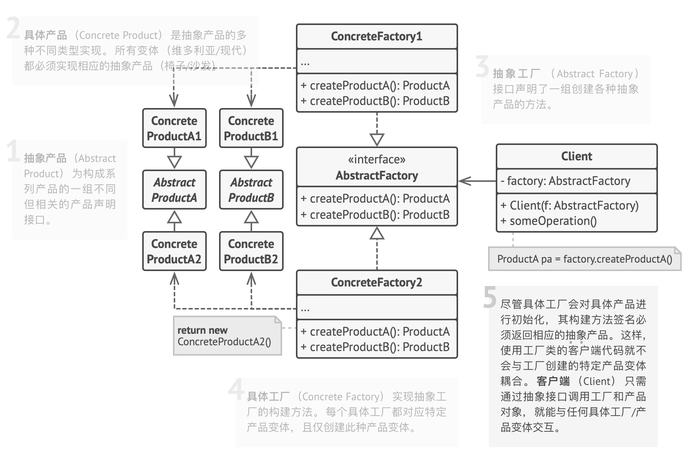
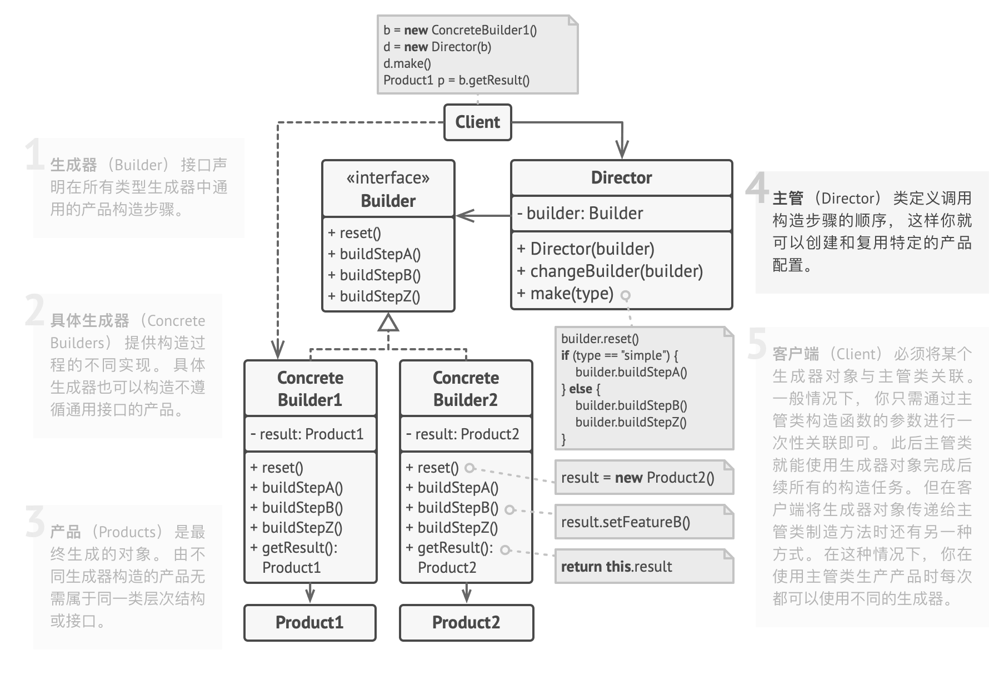
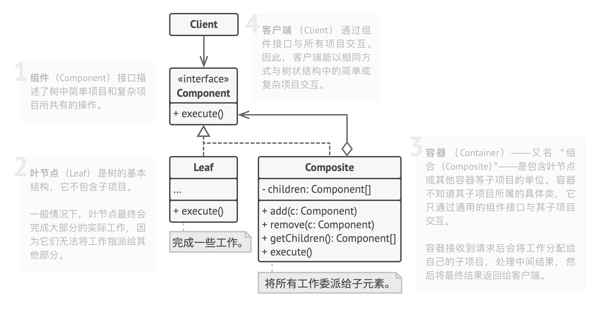
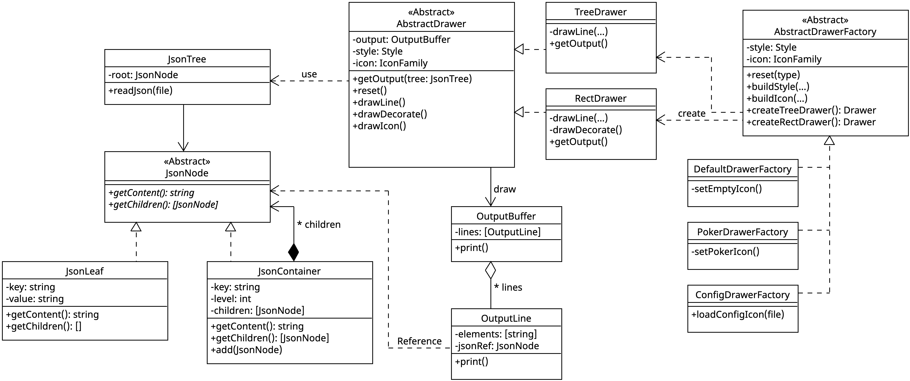
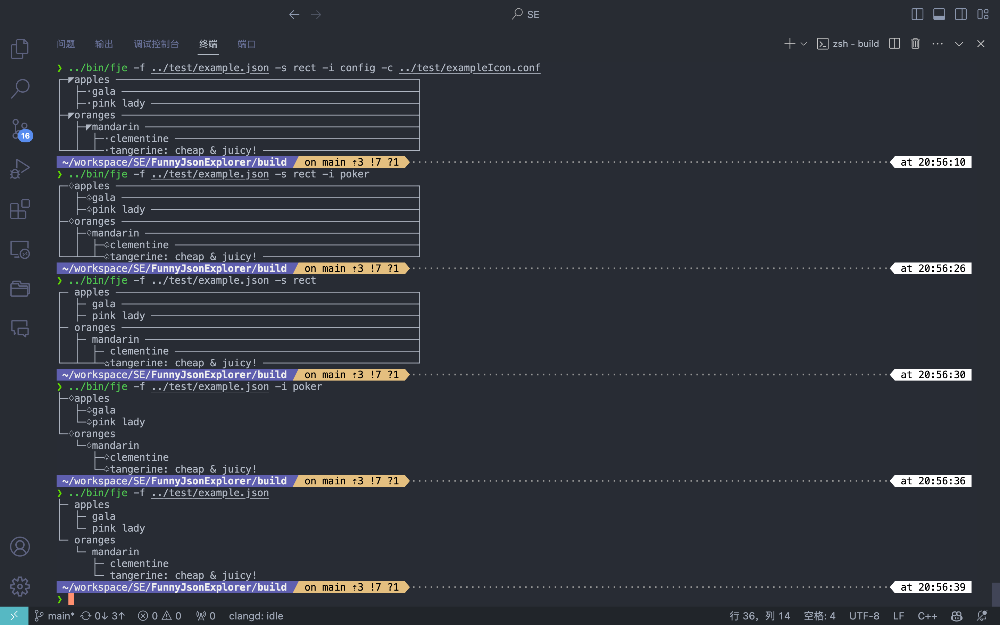

SE homework from HYJ，直接在作业要求后面完成，提交内容见最后的 submit 章节，中间属于草稿/笔记。

[toc]

# Funny JSON Explorer

Funny JSON Explorer（**FJE**），是一个JSON文件可视化的命令行界面小工具

```shell
fje -f <json file> -s <style> -i <icon family>

```

```
{
    oranges: {
        'mandarin': {                            ├─ oranges
            clementine: null,                    │  └─ mandarin
            tangerine: 'cheap & juicy!'  -=>     │     ├─ clementine
        }                                        │     └─ tangerine: cheap & juicy!
    },                                           └─ apples
    apples: {                                       ├─ gala
        'gala': null,                               └─ pink lady
        'pink lady': null
    }
}
````

FJE可以快速切换**风格**（style），包括：树形（tree）、矩形（rectangle）；

```

├─ oranges                             ┌─ oranges ───────────────────────────────┐
│  └─ mandarin                         │  ├─ mandarin ───────────────────────────┤
│     ├─ clementine                    │  │  ├─ clementine ──────────────────────┤
│     └─ tangerine: cheap & juicy!     │  │  ├─ tangerine: cheap & juicy! ───────┤
└─ apples                              ├─ apples ────────────────────────────────┤
   └─ gala                             └──┴─✩gala ───────────────────────────────┘

        树形（tree）                                   矩形（rectangle）
````

也可以指定**图标族**（icon family），为中间节点或叶节点指定一套icon

```
├─♢oranges                                 
│  └─♢mandarin                             
│     ├─♤clementine                        
│     └─♤tangerine: cheap & juicy!    
└─♢apples                                  
   └─♤gala                                 

poker-face-icon-family: 中间节点icon：♢ 叶节点icon：♤                 
```


## 领域模型


## 作业要求

基于上述需求描述和领域模型，按照设计模式要求，进行软件设计，并编码实现（任何语言均可）。

### 设计模式
使用**工厂方法**（Factory）、**抽象工厂**（Abstract Factory）、**建造者**（Builder）模式、**组合模式**（Composition），完成功能的同时，使得程序易于扩展和维护。
1. （必做）：不改变现有代码，只需添加新的抽象工厂，即可添加新的风格
2. （选做）：通过配置文件，可添加新的图标族

### 作业提交
1. 设计文档：类图与说明，说明使用的设计模式及作用
2. 运行截图：两种风格，两种图标族，共计4次运行fje的屏幕截图
3. 源代码库：公开可访问的Github repo URL


## 参考资料

1. unicode 制表符与图标： https://unicode.yunser.com/


[toc]

## 前置学习

### 创建型 - 简单工厂

- 单独用一个 creator 负责类的创建
  - *单一职责原则*。将**创建**产品的代码与实际**使用**产品的代码分离

### 创建型 - 工厂方法

使用特殊的工厂方法代替对于对象构造函数的直接调用 （即使用 `new`运算符），在父类中提供这个工厂方法， 由子类决定实例化对象的类型。

- 场景：

  - ProductBase -> Product_1, Product_2, Product_3
  - 对象构造 / 实例化的问题，已存在 Creator 类的情况
    - 这里的 Client 代码指的是调用 creator 的代码

- 原来的问题：Creator 要写繁复的判断代码，对不同的构造要求决定对应的构造方式

  ```cpp
  ProductBase* CreateProduct(req) {
    if (req.getType == 1) {
     	...
    }
    else if (req.getType == 2) {
      ...
    }
    else {
      ...
    }
  }
  ```

- 工厂方法之后：

  

- 优点：

  - *单一职责原则*。将**创建**产品的代码与实际**使用**产品的代码分离：添加新产品 C 时，独立地添加一个 C 的工厂方法
  - *开闭原则*。无需更改现有的客户端代码， 就可以在程序中引入新的产品类型。

### 创建型 - 抽象工厂

工厂方法再下分，实现不同变体风格系列的工厂

- 场景：

  - 多种抽象产品 x 多种具体变体风格

- 原来的问题：

  - 还是繁复的 if 判断，现在有了两层 if

- 抽象工厂模式

  - 每种**抽象产品**明确声明接口；产品的**具体变体**继承该接口
  - 抽象工厂明确每种**抽象产品**的构造方法接口，仅返回抽象产品类型
  - 基于抽象工厂接口创建不同的工厂类，每个工厂类对应一种**具体变体风格**，实现具体构造方法，返回真正的具体产品类型

  

- 优点：
  - 确保同一具体工厂生成的产品相互匹配，即同一种变体风格
  - *单一职责原则*、*开闭原则*


### 创建型 - 建造者

对象构造代码从产品类中抽取出来， 并将其放在一个名为 Builder 的独立对象中

- 场景：

  - 多组件的复杂对象的构造，每个组件都能有不同

- 原来的问题

  1. 要么就创建每种组合对应的子类，子类数量过多
  2. 要么使用超级构造函数，参数数量过多，大部分没有必要

- builder

  - 将对象构造过程划分为一组步骤
  - 想实现新组合对象的构造，只需要定义一组调用/配置
    - 可以额外实现一个主管类 Director 负责配置管理

  

- 优点：
  - 无需一个很多重载的超级构造函数
  - 分步创建对象， 可以暂缓创建步骤或递归运行创建步骤
  - 复用相同的制造代码
  - *单一职责原则*


### 结构型 - 组合

使用一个通用接口来表示成员关系的类，实现递归的下溯方法

- 场景

  - 树状的类成员关系
  - 需要计算所有成员的总价，但难以获知每层的包含关系

- 组合模式

  - 叶子节点 Leaf / 中间节点 Composite

  

## 开发过程

### 需求工程

- functional req
  1. 用户提供有效的 JSON 文件路径时，读取并解析 JSON 文件
     - 格式支持
       - 支持 json 字典，但不支持 json array
       - 空值记为 `null`，其他值必须有引号 `'null'`
  2. 用户能够改变命令行参数，在不同的可视化样式之间切换
  3. 用户能够改变命令行参数，中间节点和叶节点在不同的图标簇之间切换
- non-functional req
  1. 清晰的报错、说明
  2. 可扩展

### 设计

#### 架构设计 v1

- JsonNode 组合模式表示 json 树
  - countRows() 统计输出行数
  - countMaxLineLen() 统计输出列最宽字符数
- JsonLeaf : JsonNode
- JsonContainer : JsonNode
- JsonTree 读取并存储 json
- Drawer 基类
  - virtual draw()
- TreeDrawer : Drawer
- RectDrawer : Drawer
- DrawerFactory 抽象工厂模式，为了处理 **风格 x 图标** 的二维工厂方法
  - 建造者模式：多个步骤生成 Drawer
  - createTreeDrawer() 默认工厂方法 无图标
  - createRectDrawer() 默认工厂方法 无图标
- PokerDrawerFactory : DrawerFactory 图标簇
- ConfigDrawerFactory : DrawerFactory 配置文件图标簇

#### 架构设计 v2

Update:

1. 将绘制过程视为构造，实例化输出结构，从而应用到建造模式，分步骤绘制

---

- JsonNode 组合模式表示 json 树
  - virtual countRows() 统计输出行数
  - virtual countMaxLineLen() 统计输出列最宽字符数
- JsonLeaf : JsonNode
- JsonContainer : JsonNode
- JsonTree 读取并存储 json
- Drawer 基类**，相当于 outputBuffer 的建造者**
  - **getOutput() 所有类型的 drawer 都相同的构造步骤：遍历 jsonTree，调用 drawStep()**
  - **drawStepX()**
- TreeDrawer : Drawer 实现自己的绘制 build 方法
- RectDrawer : Drawer 实现自己的绘制 build 方法
- DrawerFactory 抽象工厂基类
  - createTreeDrawer() 默认工厂方法 无图标
  - createRectDrawer() 默认工厂方法 无图标
- PokerIconDrawerFactory : DrawerFactory 方片、黑桃图标簇
- ConfigIconDrawerFactory : DrawerFactory 配置文件图标簇
- **OutputBuffer **
- **OutputLine**
  - JsonNode 引用


#### 架构设计 v3

update:

1. Drawer 还是得判断是 Leaf / Container，没有真正用到组合模式。考虑在 Drawer 中实现 drawLeaf / drawContainer 独立的绘制函数，

---

- JsonNode 
  - **virtual draw(drawer)**
- JsonLeaf : JsonNode
  - **draw(drawer) 调用 drawLeaf()**
- JsonContainer : JsonNode
  - **draw(drawer) 调用 drawContainer()**
- JsonTree
- Drawer
- TreeDrawer : Drawer 实现自己的绘制 build 方法
- RectDrawer : Drawer 实现自己的绘制 build 方法
- DrawerFactory
  - createLeafDrawer()
  - createRectDrawer()
- PokerIconDrawerFactory : DrawerFactory 
- ConfigIconDrawerFactory : DrawerFactory 
- OutputBuffer
- OutputLine
  - TreeLine
  - RectLine


#### 架构设计 v4

继承 v2，把 style, icon family 抽象出来实现更多的代码复用

---

- JsonNode 组合模式表示 json 树
  - virtual countRows() 统计输出行数
  - virtual countMaxLineLen() 统计输出列最宽字符数
- JsonLeaf : JsonNode
- JsonContainer : JsonNode
- JsonTree 读取并存储 json
- Drawer 基类
- TreeDrawer : Drawer 实现自己的绘制 build 方法
- RectDrawer : Drawer 实现自己的绘制 build 方法
- DrawerFactory 抽象工厂基类
  - createTreeDrawer() 默认工厂方法 无图标
  - createRectDrawer() 默认工厂方法 无图标
- EmptyIconDrawerFactory : DrawerFactory 空格图标簇
- PokerIconDrawerFactory : DrawerFactory 方片、黑桃图标簇
- ConfigIconDrawerFactory : DrawerFactory 配置文件图标簇
- OutputBuffer 
- OutputLine
- **IconFamily**
  - 但没必要
- **Style**
  - **TreeStyle**
  - **RectStyle**


#### 模块设计

最终使用架构 v2，但 Node 提供一个 getChildren 实现 draw 处的统一（Leaf 返回空数组）

- JsonNode 组合模式表示 json 树
  - virtual countRows() -> int 统计输出总行数
  - virtual countMaxLen() -> int 统计 content 的最宽字符数
  - virtual drawContent() -> string
  - virtual getChildren() -> vector<JsonNode>
- JsonLeaf : JsonNode
  - name
  - Value
  - countRows() countMaxLineLen()
  - drawContent() -> string 输出 `name: value` 或者空值的 `name`
  -  getChildren() -> 返回空向量
- JsonContainer : JsonNode
  - name
  - level 层级，root从0开始
  - children vec[]
  - add()
  - countRows() countMaxLineLen()
  - drawContent() -> string 输出 `name`
  -  getChildren() -> 返回 children

- JsonTree 类

  - JsonNode root 表示 JSON 树对象

  - 构造函数

    1. 默认无

    2. 输入 JSON 文件，调用 read, parse

  - readJson() 读取 JSON 文件

  - parseJson() 解析 JSON 文件为一棵 JsonNode 的树
  - clearJson()

---

- Drawer 基类

  ```
  ├─ oranges                             ┌─ oranges ───────────────────────────────┐
  │  └─ mandarin                         │  ├─ mandarin ───────────────────────────┤
  │     ├─ clementine                    │  │  ├─ clementine ──────────────────────┤
  │     └─ tangerine: cheap & juicy!     │  │  ├─ tangerine: cheap & juicy! ───────┤
  └─ apples                              ├─ apples ────────────────────────────────┤
     └─ gala                             └──┴─✩gala ───────────────────────────────┘
  ```

  - rowIdx, jsonDepth 当前的绘制状态
  - 一些用于 Indents 的字符串
    - branch, vertical, branchEnd, verticalEnd  默认均为 3 space
  - outputBuffer 建造对象
  - virtual getOutput() 默认实现：
    - 调用 drawNode(root, "", "") 然后调用 drawDecorate()
  - virtual drawNode(jsonNode, selfIndent, childIndent) 建造步骤，默认实现：
    1. 副作用：把当前 OutputLine 加入 OutputBuffer: selfIndent + jsonNode.drawContent()
    2. 每个孩子：drawNode(child, childIndent + branch, childIndent + vertical)
  - virtual drawDecorate() 最后一个步骤，对 OutputBuffer 进行最后的处理

- TreeDrawer : Drawer 
  - drawNode() 
    - 无新的实现
  - drawDecorate() 特殊替换处理
    - 去除 root 行
- RectDrawer : Drawer
  - drawNode()
    - rect 的每行不同：增加 lineHorizon 到 countMaxLineLen + 3，然后补一个 `┤`
  - drawDecorate() 特殊替换处理
    - 去除 root 行
    - rect 的首行：首字符、尾字符 `┌ ┐`
    - rect 的尾行：增加 ✩，首字符、尾字符 `└ ┘`

---

- DrawerFactory 抽象工厂基类

  - setDefaultChar() 对于通用字符元素，给一个默认值

    ```
                     tree  / rect
    branch           '├─ '   '├─ '
    Vertical         '│  '   '│  '
    branchEnd        '└─ '   '├─ '
    VerticalEnd      '   '   '│  '
    ```

  - createTreeDrawer() 默认工厂方法 无图标

  - createRectDrawer() 默认工厂方法 无图标

- PokerDrawerFactory : DrawerFactory 图标簇

  - createTreeDrawer() createRectDrawer() 

- ConfigDrawerFactory : DrawerFactory 配置文件图标簇

  - 构造函数可传入配置文件
  - createTreeDrawer() createRectDrawer() 

---

- OutputLine 类
  - elements: [str]
    - 如果是 tree style，indent + content
    - 如果是 rect style，indent + content + 补全
- OutputBuffer 类
  - lines: [line]
  - print()

---

使用 cxxopts 库完成前端参数 parsing，使用 nlohmann-json 库完成 json 文件读取


## 问题

### open

- 关于架构设计v3中的问题，我选择第二种方法

  1. 使用 jsonNode 的多态虚函数来调用对应的 drawer 函数，避免 draw 的 if 判断
     - 但这样子 draw 会引用 node，node 也需要传入 drawer，相互引用

  2. 或者为 Node 添加一个通用的类型判断 isLeaf；或者添加通用的 getChildren，只是 leaf 返回空
     - 但是这样就相当于在 draw 里面判断当前 Node 是什么动态类型的，似乎不符合开闭原则？
  
- Obj 基类肯定是要先写的？之后应该先构建 factory，还是先把基础的带构造函数 obj 子类实现出来？
  - 先 factory 可能后面还要改，先搞个 obj 子类的例子似乎有助于写 factory
  
- 抽象工厂的 client 代码要怎么用？
  - registry + param mux 


### closed

- 制表符属于 utf-8，str.size() 需要额外处理

  - 直接使用 indent 计数，不使用 string.size()

- DrawerFactory 需要访问 Drawer 的 protected 成员

  - 我试着让 Drawer friend class DrawerFactory，但是 DrawerFactory 的子类没有吃到这个 friend 关系

  - 继续在 DrawerFactory 基类里实现一个 setXX 函数（非 virtual）

- JsonNode 利用统一的 getChildren 来避免客户端判断 leaf / container

- 抽象工厂里，两个维度的产品怎样复用代码，例如：

  - Drawer
    - PokerDrawer
      - TreePokerDrawer
      - RectPokerDrawer

    - ConfigDrawer
      - TreeConfigDrawer
      - RectConfigDrawer

  这里同一种 ICON 的 drawer 当然容易，但是 Tree drawer 的代码并不容易复用

  想到一种办法：二维继承 / 成员

    ```cpp
  class IconFamily;
  class PokerIconFamily : IconFamily;
  class ConfigIconFamily : IconFamily;
  
  class Style;
  class TreeStyle : Style;
  class RectStyle : Style;
  
  // 1.二维继承，每个最终子类调用基类的方法
  class TreePokerDrawer : TreeStyle, PokerIconFamily;
  // 
  
  // 2. 二维成员，每个最终子类调用成员的方法
  class TreePokerDrawer {
  	std::unique_ptr<IconFamily> iconFamily;
    std::unique_ptr<Style> style;
  }
    ```


## Submit

### 类图



### 设计模式

- 建造者模式

  1. Drawer

     - AbstractDrawer 是抽象建造者，定义了默认的 reset() 和 getResult()，以及 drawLine(), drawDecorate(), drawIcon() 步骤的模版，建造的目标是 OutputBuffer 对象；

     - TreeDrawer 和 RectDrawer 是具体建造者，对应建造不同风格的 OutputBuffer；
       - 由于不同 Style 差异不大，完全可以复用输出缓存区，所以没有给 OutputLine 创建子类（TreeOutputLine, RectOutputLine）

  2. DrawerFactory

     - AbstractDrawerFactory 也是抽象建造者，建造的目标是 Drawer 对象

- 工厂方法模式 & 抽象工厂模式

  - AbstractDrawerFactory 是抽象工厂；
  - DefaultDrawerFactory, PokerDrawerFactory, ConfigDrawerFactory 是具体工厂，分别指定了不同的 Icon family
    - 由于不同 IconFamily 的绘制代码差异不大，完全可以复用，所以没有给风格 Drawer 下面再创建不同 icon 的子类（TreePokerDrawer...）
  - 每个具体工厂都有 createTreeDrawer 和 createRectDrawer 工厂方法，对应生成具体的 TreeDrawer, RectDrawer 对象 

- 组合模式

  - JsonNode 是组合模式中的通用接口，JsonLeaf 和 JsonContainer 是具体结构
  - 通用操作比较多，包括 getContent() 和 getChildren()
    - 我认为保存 Json 的部分和绘制 Json 的部分应该分离，因此没有利用组合模式的通用操作完成绘制，而是交由另一个 Drawer 模块来完成


### 输出  


